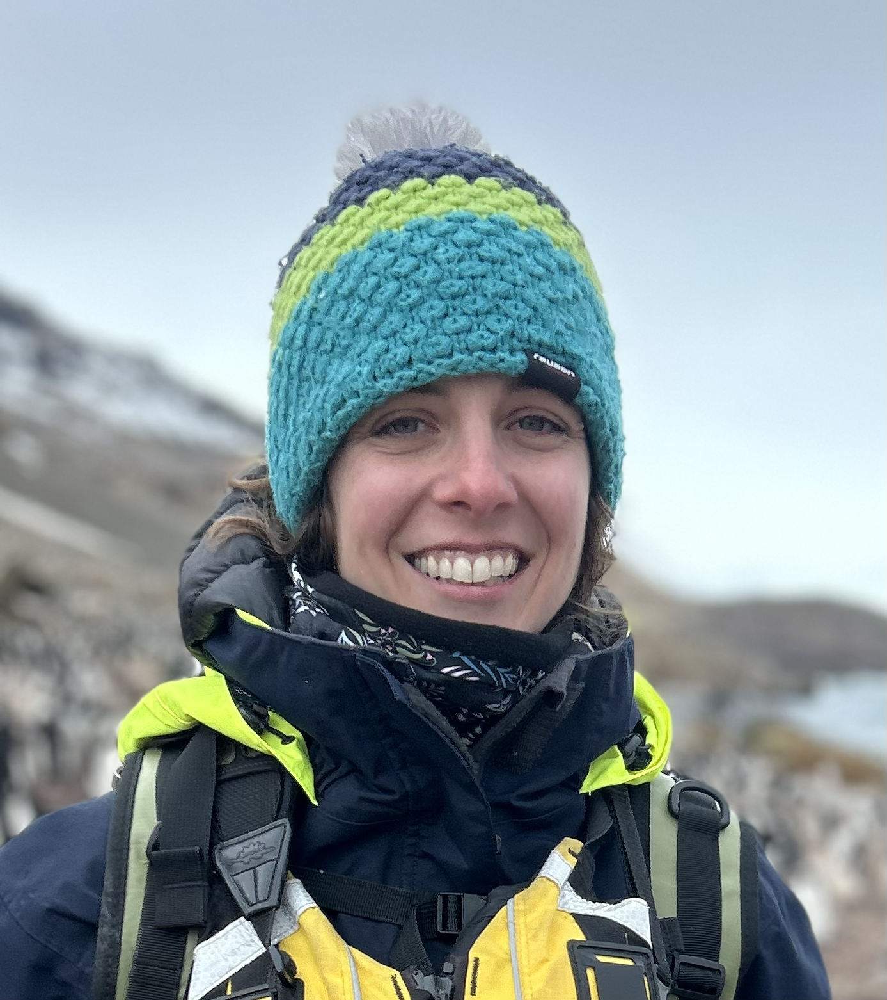

Welcome to my website! I am an NSF Office of Polar Progam's <a href="https://www.nsf.gov/geo/opp/postdoctoral-awardees#2023-awardees-231/">Postdoctoral Research Fellow</a> specializing in genomics, epigenetics, bioinformatics, and conservation biology  <a href="https://you.stonybrook.edu/veeramahlab/">Krishna Veeramah's Lab</a> in the Department of Ecology & Evolution at Stony Brook University. I research the molecular ecology and genomics of seabirds, particulary those found in the Antarctic and sub-Antarctic. I received my Ph.D. in Ecology & Evolution in <a href="https://www.lynchlab.com/">Heather Lynch's Lab</a> at Stony Brook University. 

<a href="http://rachaelherman.github.io/research/Rachael_Herman_CV_2025.pdf" class="btn">Curriculum Vitae</a>

Contact:

* email: <a href="mailto:rachael.herman@stonybrook.edu" target="_blank"><b>rachael.herman@stonybrook.edu</b></a>

